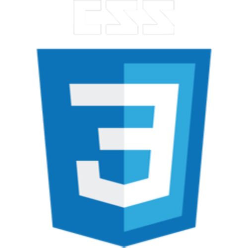
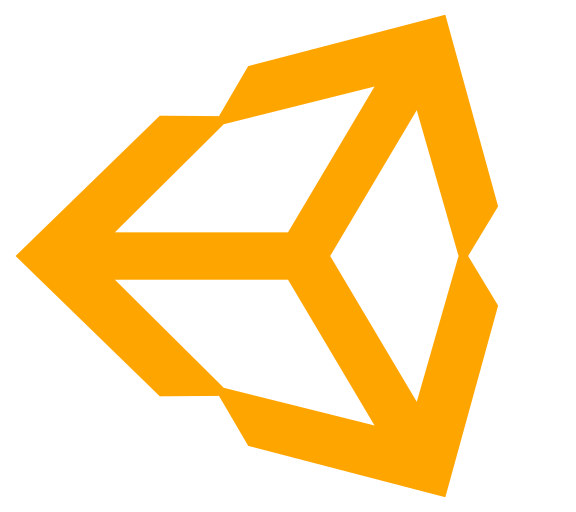
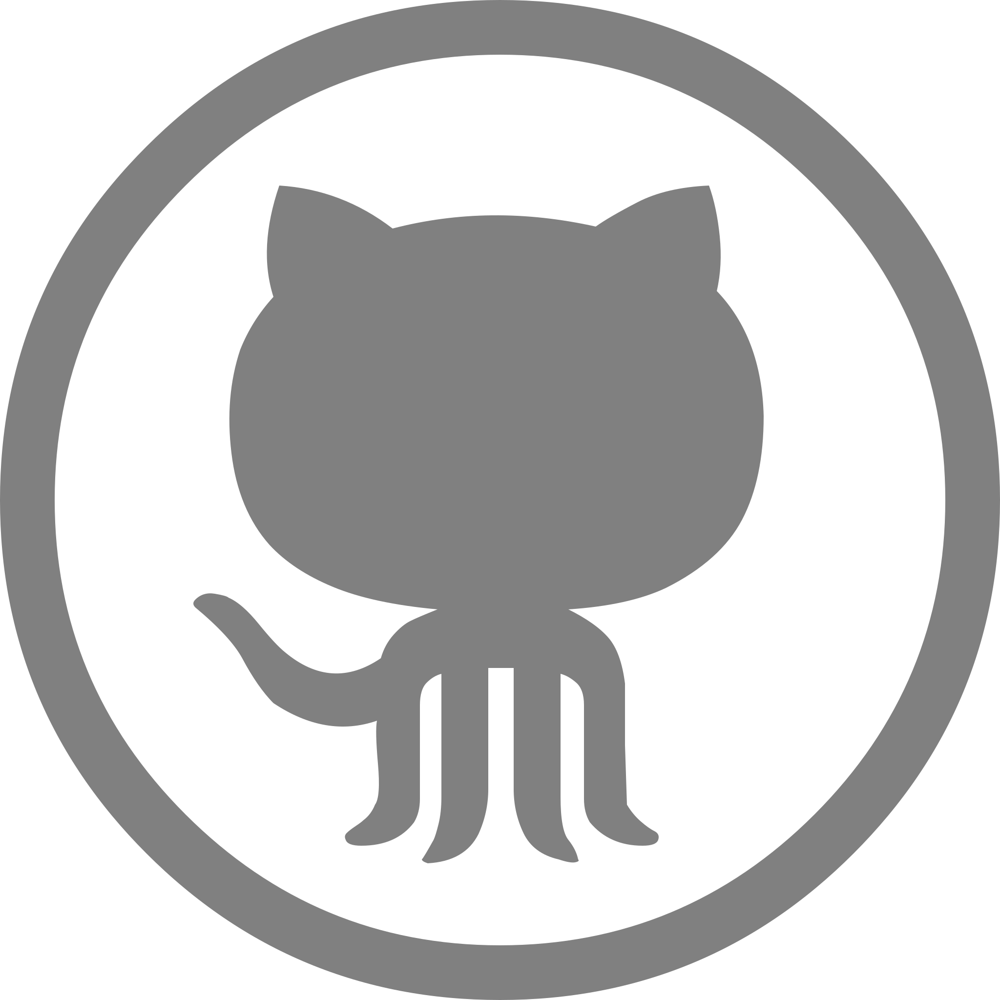

#   Hello! 👋 I am Orlando Landaeta   Computer graduate

### Computer graduate, currently doing a Master's in Interactive Technologies and Digital Manufacturing at the U.P.V. and in my free time I like to spend them between video games and model airplanes.
 
 

## 💻 Skills

### Web Design

     &nbsp
     &nbsp
     &nbsp
     &nbsp

### Mobile Programming

     &nbsp
     &nbsp

### Programming

     &nbsp
     &nbsp
     &nbsp

### Data Management

     &nbsp
     &nbsp

### 3D Design

     &nbsp
     &nbsp
     &nbsp

 
 

## 📬 Contact

 
 

##  Github Stats 

 

